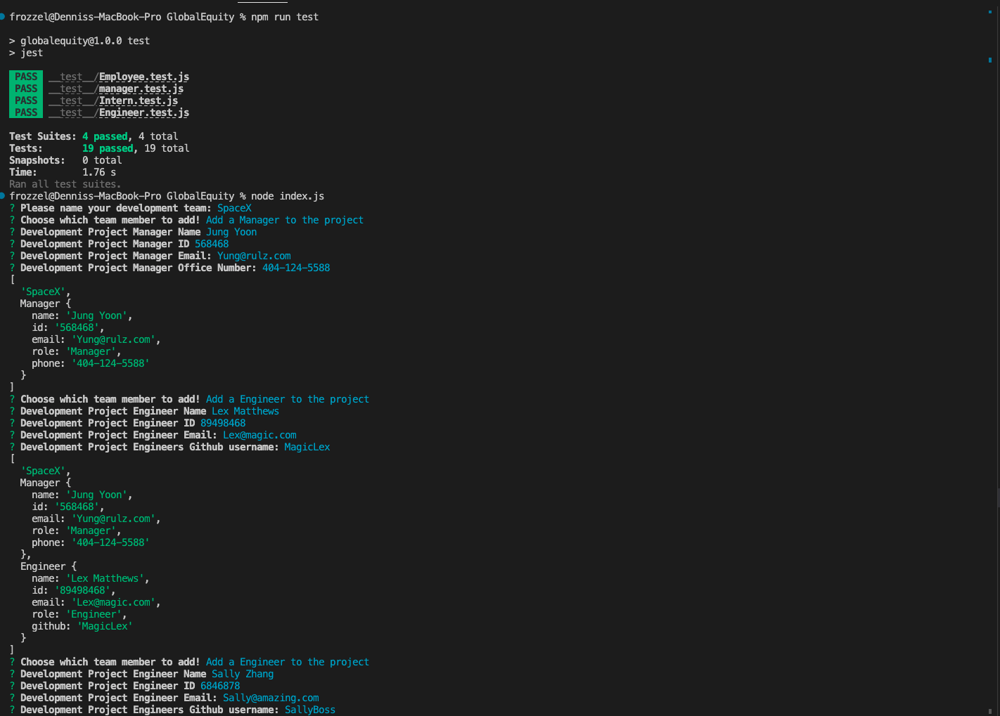

# Global Equity 
 
  ## Description
  Node.js command-line application that takes in information about employees on a software engineering team and generates an HTML webpage that displays summaries for each person.

  -Learn testing with TDD and gain more Node JS skills.
  
  -The Profile builder creates a Web page based on user input of thier projects team.
  
  -Quickly generate Development teams basic information.

  
  ## Table of Contents (Optional)
  
  - [Installation](#installation)
  - [Usage](#usage)
  - [Resources](#resources)
  - [License](#license)
  - [Test](#tests)
  - [Contributors](#contributors)
  
  ## Installation
  First download Node Js to your local machine. Then download the files from github. You will need to install both Inquirer `npm i inquirer@8.2.4`and Jest by using the provided package.json and typing npm i to install the required NPM files. Then just open the console to the index js file and type node index.js !!
  
  ## Usage
  [Vist Our Site](http://frozzel.github.io/GlobalEquity/)
  
  [Video](https://youtu.be/9YzzNMa68jI)
  

  ## Resources

  [BootStrap](https://getbootstrap.com/docs/5.2/layout/grid/)

  [Jest](https://archive.jestjs.io/docs/en/24.x/expect)

  [Freepik](https://www.freepik.com/free-vector/business-people-in-meeting_2770453.htm)

  [Logo](https://logo.com)
  
  
  ## License
  
  
  
  ## Tests

  Just install from above instructions and then type npm run test. Enjoy!!!
  
  ## Contributors 

  Created by: [@frozzel](http://github.com/frozzel)
  
  Please contact me with questions at: frozzel@me.com
  
  Fun Movie Fact: 
  
  We are all Giants, Some are just waiting to stand!

